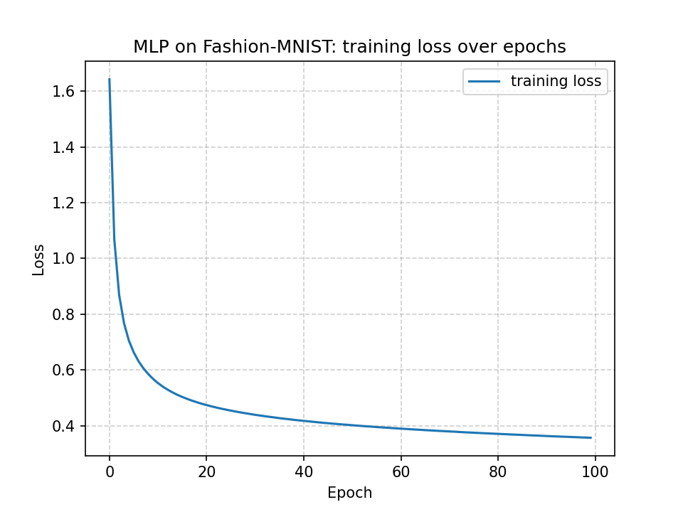

This is a multilayer perceptron image classification model. 

It classifies images of fashion items from the MNIST dataset (mnist_fashion.pkl), and saves the predicted classes into PRED_mlp.dat.

With the following specs it achieved a testing accuracy of 85.70% and and training accuracy of 87.70%:
- sequential model
- 1 hidden layer, 64 neurons
- 1 output layer, 10 neurons
- sigmoid activation function for the hidden layer
- softmax activation function for the output layer
- categorical crossentropy loss function
- stochastic gradient descent optimizer
- batch size of 64
- learning rate of 0.02
- 100 epochs

