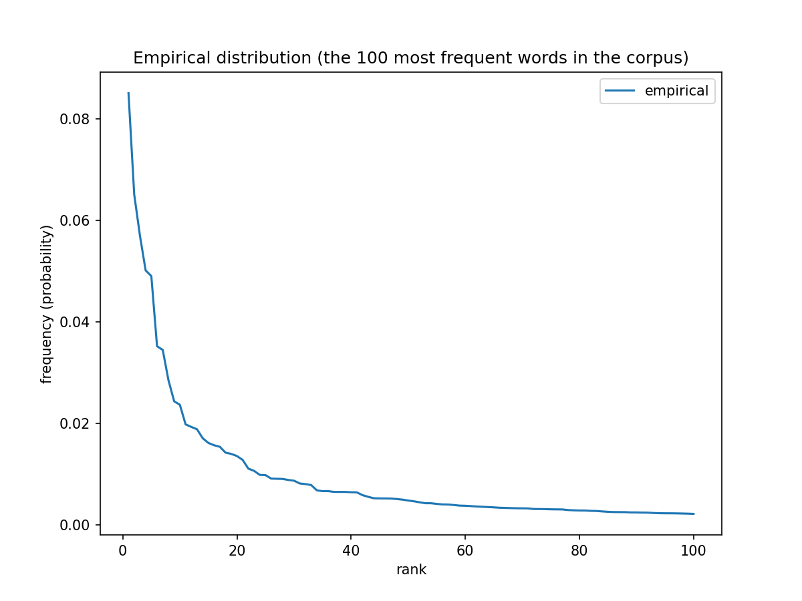
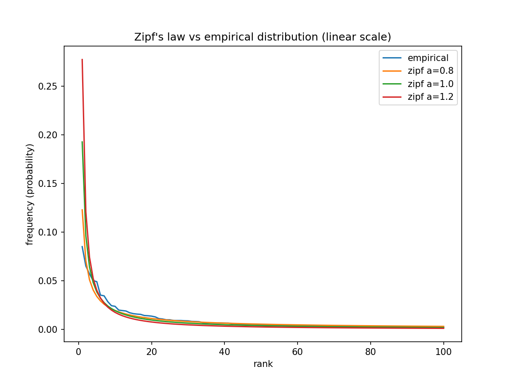
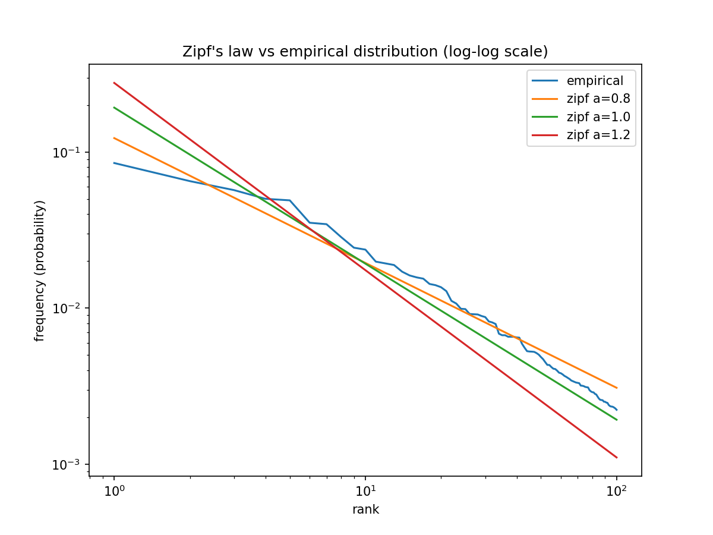

This was done as part of an assignment on Statistical Methods for Text Data Analysis (DATA.STAT.840 in Tampere university).

## Assignment
1. Create a web crawler that downloads top-_k_ most recently (30 days) downloaded ebooks from Project Gutenberg, and download said ebooks (_k_=20 in this assignment)
2. Implement a data processing pipeline with NLTK
    - text cleanup, tokenization, lemmatization, vocabulary building
3. Build a frequency map for the 100 most frequent words in the corpus
4. Plot the frequency map and compare it to different plots of Zipf's law, and estimate a value for the exponent _a_ which most closely approximates the empirical data

----

## Zipf's law
Zipf's law says that word frequency in a given natural language corpus is inversely proportional to its rank in the frequency table:  
$p(w) = \frac{1 / \mathrm{rank}(w)^a}{\sum_{k=1}^V 1/k^a}$

where _p(w)_ is the proportion of the word _w_ in the whole corpus (thus the probability to receive word _w_ on a random draw), and _a_ is an exponent characterizing the distribution.

----

## Method / implementation
- **crawler** (`crawl_and_process.py`) downloads the books and builds a cleaned vocabulary
- **preprocessing**: 
    - gutenberg regex removal
    - tokenization 
    - lemmatization
    - stopword removal
    - I retained "I" and "a" as legit words but removed others with only one character
- **analysis** (`plot_zipf.py`): saves frequency map and generates plots

----

## Results

### top five words by frequency in the downloaded corpus:

| rank | word | count   |
|------|------|---------|
| 1    | the  | 156,788 |
| 2    | be   | 120,050 |
| 3    | and  | 105,131 |
| 4    | of   | 92,472  |
| 5    | to   | 90,402  |

[the whole top 100 are in results/top_100.txt](./results/top_100.txt)

First, what the distribution of the top 100 words looks like when plotted on a linear scale:

Then, the same distribution compared against Zipf’s law with different exponent values $a \in \{0.8, 1.0, 1.2\}$:

Of these three values, it seems the value a=0.8 might be closest to our empirical distribution. The relationship can be better visualized on a log-log scale[^1] instead of a linear scale: 

Based solely on this visualization, it is impossible to rigorously conclude which of the hypothetical Zipf-plots are the closest to the empirical line, but it would seem to fall between the $a=0.8$ and $a=1.0$ lines.

[^1]: In a log-log scale, both axes are displayed logarithmically. Because the logarithm turns exponents into multipliers, the power-law relationship intrinsic to Zipf's law that appears hyperbolic (curved) on a linear scale becomes a straight line on a log-log scale. This makes it much easier to see which theoretical slope (value of $a$) best matches the empirical distribution, since deviations from the expected power-law show up as departures from a straight line.

----

## Conclusions, inferences, postulation

- The corpus used (the top 100 words in the 20 most recently popular English books) empirically reflected Zipf's law, with an approximated exponent slightly below 1 but above 0.8
- Words that have the highest rank in the frequency table also have the least semantic or informational density
    - Zipf’s law highlights an inverse relation between frequency and information: the most common words occur constantly but carry almost no semantic load on their own; while rare words, though infrequent, are densely informative and context-heavy
    - The distribution thus stretches from _maximal generality at the top_ to _maximal particularity at the tail_
    - Zipf’s law can be seen as a kind of _quantitative inverse_ of the [Pareto principle](https://en.wikipedia.org/wiki/Pareto_principle): if considering merely the frequency of words, the most common words are the most consequential; and so Pareto is a _qualitative inverse_ of Zipf’s law: the rarest words tend to be semantically the most consequential
